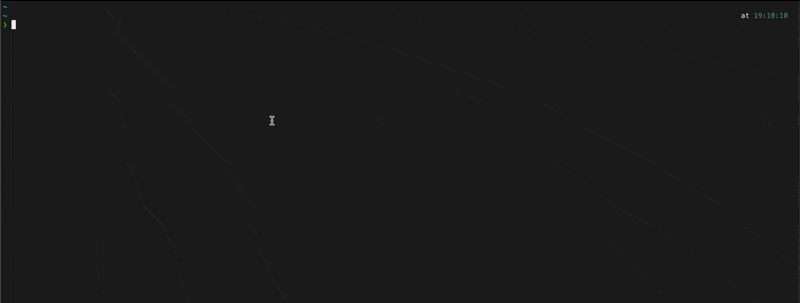

# claude-sessions

Monitor and attach to Claude Code sessions in your terminal.



## Installation

```bash
pip install claude-sessions
```

## Usage

### Monitor running sessions (default)

```bash
claude-sessions
```

Real-time monitoring of all active Claude Code processes. Updates every 3 seconds.

### List saved sessions

```bash
claude-sessions list
```

Shows all saved sessions from `~/.claude/projects/` with:
- Session ID
- Working directory
- Last activity time
- First message summary

### Attach to a session

```bash
# Interactive selection
claude-sessions attach

# By number (from list)
claude-sessions attach 1

# By session ID (partial match)
claude-sessions attach 64b1fd94
```

Resumes a previous conversation using `claude --resume`.

## Commands

| Command | Alias | Description |
|---------|-------|-------------|
| `monitor` | (default) | Monitor running sessions |
| `list` | `ls` | List saved sessions |
| `attach` | `a` | Attach to a saved session |

## Features

- Real-time monitoring of all Claude Code CLI sessions
- List and resume saved sessions
- Interactive session selection
- Shows PID, working directory, terminal, uptime, and status
- Clean TUI with [rich](https://github.com/Textualize/rich)

## Requirements

- Python 3.10+
- macOS or Linux
- Claude Code CLI installed

## License

MIT
